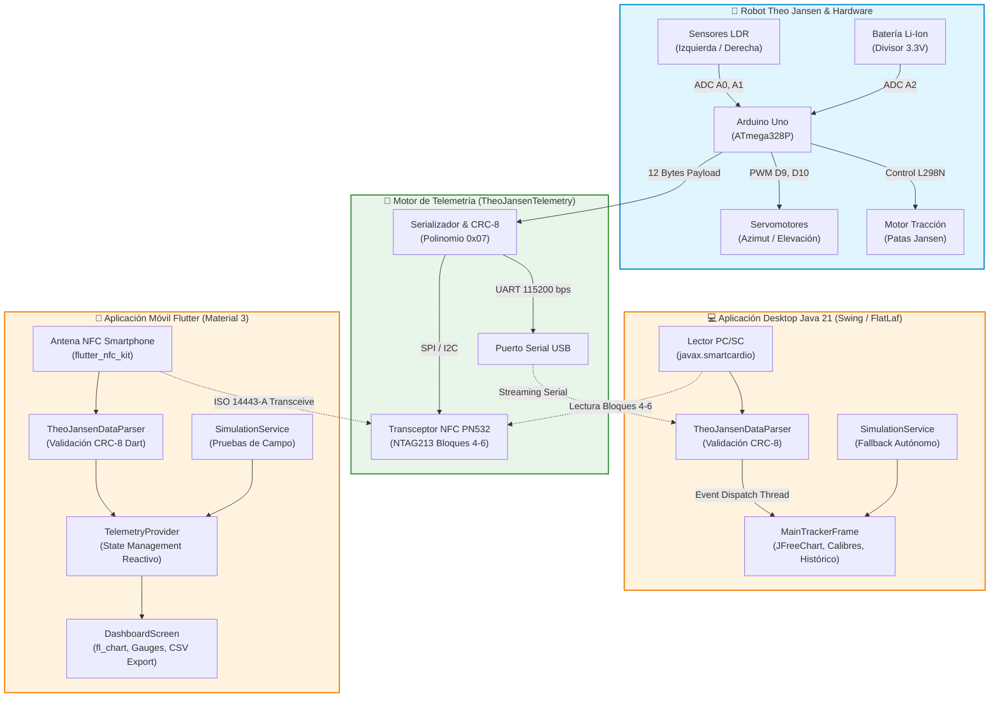

# ☀️ Heliostrand NFC Core: Bio-Inspired Solar Tracker & Dual Telemetry

<div align="center">

[](#firmware-arduino-c)
[](#aplicación-desktop-java-21)
[](#aplicación-móvil-flutter)
[-4CAF50.svg)](#protocolo-de-telemetría-binaria)
[](#arquitectura-del-sistema)
[](#-gobernanza-y-contribución)

**Ecosistema ciberfísico para robots caminantes bio-inspirados (Mecanismo de Theo Jansen) equipados con seguimiento solar biaxial autónomo y telemetría de campo cercano (NFC).**

---

### 📥 Enlaces Directos de Descarga (Releases)

| Plataforma | Binario / Instalador | Estado & Requisitos | Enlace de Descarga |
| :--- | :--- | :--- | :---: |
| 📱 **App Móvil (Android)** | `heliostrand-app.apk` | Android 7.0+ (NFC activado) | [⬇️ **Descargar APK Android**](https://github.com/RamsesCB/heliostrand-nfc-core-cpp/releases/latest/download/heliostrand-app.apk) |
| ☕ **App Desktop (PC/Mac/Linux)** | `AplicacionJava-1.0-SNAPSHOT-jar-with-dependencies.jar` | Java 21 LTS (Standalone) | [⬇️ **Descargar JAR Desktop**](https://github.com/RamsesCB/heliostrand-nfc-core-cpp/releases/latest/download/AplicacionJava-1.0-SNAPSHOT-jar-with-dependencies.jar) |
| 📦 **Repositorio de Releases** | Códigos fuente y activos empaquetados | GitHub Releases | [📂 **Ver todas las versiones**](https://github.com/RamsesCB/heliostrand-nfc-core-cpp/releases) |

---

</div>

## 📑 Tabla de Contenidos

- [Visión General del Sistema](#-visión-general-del-sistema)
- [Arquitectura del Sistema](#-arquitectura-del-sistema)
- [Protocolo de Telemetría Binaria (12 Bytes)](#-protocolo-de-telemetría-binaria-12-bytes)
- [Componentes del Monorepositorio](#-componentes-del-monorepositorio)
  - [1. Firmware Arduino C++ (`src/`, `include/`)](#1-firmware-arduino-c-src-include)
  - [2. Aplicación Desktop Java 21 (`AplicacionJava/`)](#2-aplicación-desktop-java-21-aplicacionjava)
  - [3. Aplicación Móvil Flutter (`heliostrand_app/`)](#3-aplicación-móvil-flutter-heliostrand_app)
  - [4. Diagramas de Diseño y UML (`docs/diagrams/`)](#4-diagramas-de-diseño-y-uml-docsdiagrams)
- [Guía de Compilación, Pruebas y Despliegue](#-guía-de-compilación-pruebas-y-despliegue)
- [Gobernanza y Contribución](#-gobernanza-y-contribución)
- [Licencia y Créditos](#-licencia-y-créditos)

---

## 🌟 Visión General del Sistema

El proyecto **Heliostrand** integra tres disciplinas de la ingeniería en una solución ciberfísica armónica:

1. **Robótica Bio-inspirada**: Cinemática de enlace plano de 11 barras de **Theo Jansen** (Strandbeest), optimizada para caminar sobre terrenos irregulares minimizando la energía disipada.
2. **Seguimiento Solar Biaxial**: Algoritmo diferencial basado en dos fotorresistencias (LDR) y actuadores servomotores para orientación en acimut y elevación, maximizando la captación de celdas fotovoltaicas.
3. **Telemetría Dual sin Contacto**:
   - **NFC Pasivo (NTAG213 / ISO 14443-A)**: Escritura atómica en los bloques de usuario 4, 5 y 6 para lectura instantánea mediante teléfonos inteligentes o lectores PC/SC sin emparejamiento Bluetooth ni consumo de radiofrecuencia activo continuo.
   - **USB/UART Serial**: Streaming continuo a 115200 baudios para depuración en tiempo real.

---

## 🏗️ Arquitectura del Sistema

El ecosistema sigue un modelo desacoplado y reactivo donde el microcontrolador es la fuente única de la verdad (*Source of Truth*), y los clientes Desktop y Mobile consumen y verifican las tramas con independencia arquitectónica:



---

## 🔬 Protocolo de Telemetría Binaria (12 Bytes)

Para optimizar el ancho de banda y garantizar almacenamiento exacto en tags NFC **NTAG213** (que organizan la memoria de usuario en bloques de 4 bytes), la telemetría se empaqueta en una estructura binaria compacta de **12 bytes** (Bloques 4, 5 y 6):

| Byte Offset | Campo | Tipo de Dato | Rango / Unidad | Bloque NTAG | Descripción |
| :---: | :--- | :---: | :---: | :---: | :--- |
| `0` - `1` | `servo1Angle` | `uint16_t` (LE) | $0 - 180^\circ$ | Bloque 4 | Ángulo de rotación del servomotor de acimut (horizontal). |
| `2` - `3` | `servo2Angle` | `uint16_t` (LE) | $0 - 180^\circ$ | Bloque 4 | Ángulo de inclinación del servomotor de elevación (vertical). |
| `4` - `5` | `ldrLeft` | `uint16_t` (LE) | $0 - 1023$ ADC | Bloque 5 | Intensidad lumínica incidente en fotocelda izquierda. |
| `6` - `7` | `ldrRight` | `uint16_t` (LE) | $0 - 1023$ ADC | Bloque 5 | Intensidad lumínica incidente en fotocelda derecha. |
| `8` - `9` | `batteryMv` | `uint16_t` (LE) | $3000 - 4200\text{ mV}$ | Bloque 6 | Tensión de alimentación medida mediante divisor resistivo. |
| `10` | `stateFlag` | `uint8_t` | Máscara Bit | Bloque 6 | Estado de tracción (Bit 7: motor activo) + Dirección de luz (Bits 0-3). |
| `11` | `checksum` | `uint8_t` | `0x00 - 0xFF` | Bloque 6 | **CRC-8** calculado sobre los primeros 11 bytes (`0` a `10`). |

### Algoritmo de Verificación CRC-8
El checksum emplea el polinomio canónico de telecomunicaciones:
$$P(x) = x^8 + x^2 + x^1 + 1 \quad (\text{Representación hexadecimal: } \mathbf{0x07})$$

$$\text{Valor Inicial: } \mathbf{0x00} \qquad \text{Operación: Desplazamiento a la izquierda con XOR condicional}$$

Cualquier cliente que detecte un byte de checksum divergente descarta la trama de inmediato, impidiendo que lecturas corruptas de RF ingresen al modelo de datos.

---

## 📂 Componentes del Monorepositorio

```text
heliostrand-nfc-core-cpp/
├── include/                  # Cabeceras C++ del Firmware Arduino
│   ├── NfcTransceiver.h       # Controlador de transceptor NFC (PN532 / SPI)
│   ├── SolarTracker.h         # Algoritmo de seguimiento solar biaxial
│   ├── TheoJansenConfig.h     # Mapeo de pines y umbrales operacionales
│   └── TheoJansenTelemetry.h  # Estructura de paquete y cálculo CRC-8 en C++
├── src/                      # Implementaciones del Firmware Arduino
│   ├── main.cpp               # Bucle principal de control en lazo cerrado
│   ├── NfcTransceiver.cpp
│   ├── SolarTracker.cpp
│   └── TheoJansenTelemetry.cpp
├── AplicacionJava/           # Aplicación Desktop Java 21 (Swing / FlatLaf)
│   ├── pom.xml                # Descriptor Maven (Java 21, FlatLaf, JFreeChart, JUnit 5)
│   └── src/
│       ├── main/java/com/
│       │   ├── theojansen/nfc/model/   # Entidades inmutables (RobotTelemetry)
│       │   ├── theojansen/nfc/core/    # Gestor PC/SC (javax.smartcardio)
│       │   ├── theojansen/nfc/parser/  # TheoJansenDataParser con validador CRC-8
│       │   └── mycompany/aplicacionjava/ # Controladores Swing y Ventana Principal
│       └── test/java/                  # Pruebas unitarias de parser y CRC-8
├── heliostrand_app/          # Aplicación Móvil Multiplataforma Flutter
│   ├── pubspec.yaml           # Dependencias (flutter_nfc_kit, fl_chart, share_plus)
│   ├── PRIVACY_POLICY.md      # Política de privacidad lista para Google Play Console
│   ├── lib/
│   │   ├── main.dart          # Punto de entrada y tema Material 3
│   │   ├── models/            # RobotTelemetry, MotorState, LightDirection
│   │   ├── services/          # NfcService, SimulationService, ReportService
│   │   ├── utils/             # TheoJansenDataParser (CRC-8 Dart)
│   │   └── widgets/           # Calibres circulares, gráficos temporales, tarjetas
│   └── test/                  # Pruebas automatizadas en Dart
├── docs/                     # Documentación y Diagramas de Arquitectura
│   └── diagrams/
│       ├── APPNFC.drawio      # Diagrama nativo editable para Draw.io / diagrams.net
│       ├── APPNFC.drawio.pdf  # Diagrama vectorial original
│       ├── Class_Diagram0.asta # Proyecto de modelo de clases en Astah
│       ├── Diagrama_lector_NFC.asta # Diagrama de secuencia y arquitectura lector NFC
│       └── NFC_2.asta         # Diagrama de componentes NFC
├── CONSTITUTION.md           # Constitución, principios inmutables y gobernanza
├── RULES.md                  # Reglas de contribución, estilos de código y commits
└── platformio.ini            # Configuración de compilación embebida PlatformIO
```

---

## 🛠️ Guía de Compilación, Pruebas y Despliegue

### 1. Firmware Arduino C++
Requiere [PlatformIO CLI](https://platformio.org/) o extensión en VSCode:
```bash
# Compilar firmware para ATmega328P (Arduino Uno)
pio run

# Cargar en la placa conectada por USB
pio run --target upload

# Abrir monitor serial a 115200 bps
pio device monitor -b 115200
```

### 2. Aplicación Desktop Java 21
Requiere JDK 21+ y Apache Maven:
```bash
cd AplicacionJava

# Ejecutar suite de pruebas unitarias
mvn test

# Compilar y empaquetar JAR standalone con todas las dependencias
mvn clean package

# Ejecutar la aplicación de escritorio
java --add-modules java.smartcardio -jar target/AplicacionJava-1.0-SNAPSHOT-jar-with-dependencies.jar
```

### 3. Aplicación Móvil Flutter
Requiere [Flutter SDK 3.x+](https://flutter.dev/):
```bash
cd heliostrand_app

# Instalar dependencias
flutter pub get

# Ejecutar pruebas unitarias de telemetría y CRC-8
flutter test

# Compilar APK de Android
flutter build apk --release
```

---

## 🏛️ Gobernanza y Contribución

Agradecemos las contribuciones de la comunidad académica y de código abierto. Antes de enviar cualquier propuesta o Pull Request, revise detenidamente los siguientes documentos normativos:

1. [**CONSTITUTION.md**](file:///home/ramsescb/Projects/arduino_app_Fundamentos/CONSTITUTION.md): Principios arquitectónicos inmutables, derechos de autoría y gobernanza técnica.
2. [**RULES.md**](file:///home/ramsescb/Projects/arduino_app_Fundamentos/RULES.md): Estándares de nombrado, formato de commits convencionales, invariantes de telemetría y lista de comprobación pre-PR.

---

## 📄 Licencia y Créditos

- **Autor Principal**: [RamsesCB](https://github.com/RamsesCB)
- **Repositorio**: [heliostrand-nfc-core-cpp](https://github.com/RamsesCB/heliostrand-nfc-core-cpp)
- **Licencia**: MIT License - Código abierto para fines académicos, de investigación y desarrollo robótico.
