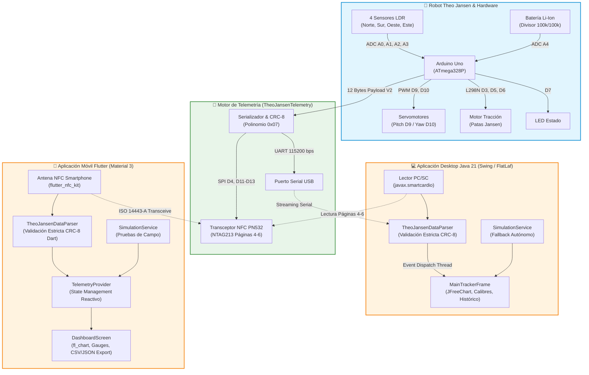

# ☀️ Heliostrand NFC Core: Bio-Inspired Solar Tracker & Dual Telemetry

<div align="center">

[](https://github.com/RamsesCB/heliostrand-nfc-core-cpp/actions/workflows/ci.yml)
[](#firmware-arduino-c)
[](#2-aplicación-desktop-java-21-aplicacionjava)
[](#3-aplicación-móvil-flutter-heliostrand_app)
[%20%7C%20CRC--8%20(0x07)-4CAF50.svg)](#-protocolo-de-telemetría-binaria-v2-12-bytes)
[-blue.svg)](#-licencia-atribución-obligatoria-y-protección-legal)

**Sistema ciberfísico para robots caminantes bio-inspirados (mecanismo de Theo Jansen) equipados con seguimiento solar biaxial autónomo y telemetría de campo cercano (NFC).**

---

### 📥 Enlaces Directos de Descarga (Releases v1.0.0)

| Plataforma | Binario / Instalador | Estado & Requisitos | Enlace de Descarga Directa |
| :--- | :--- | :--- | :---: |
| 📱 **App Móvil (Android)** | `heliostrand-app.apk` | Android 7.0+ (NFC activado) | [⬇️ **Descargar APK Android**](https://github.com/RamsesCB/heliostrand-nfc-core-cpp/releases/download/v1.0.0/heliostrand-app.apk) |
| ☕ **App Desktop (PC/Mac/Linux)** | `AplicacionJava-1.0.0-jar-with-dependencies.jar` | Java 21 LTS (Standalone) | [⬇️ **Descargar JAR Desktop**](https://github.com/RamsesCB/heliostrand-nfc-core-cpp/releases/download/v1.0.0/AplicacionJava-1.0.0-jar-with-dependencies.jar) |
| 📦 **Repositorio de Releases** | Registro de binarios y notas | GitHub Releases | [📂 **Ver Release v1.0.0**](https://github.com/RamsesCB/heliostrand-nfc-core-cpp/releases/tag/v1.0.0) |

---

</div>

## 📑 Tabla de Contenidos

- [Visión General del Sistema](#-visión-general-del-sistema)
- [Arquitectura del Sistema](#-arquitectura-del-sistema)
- [Mapeo de Hardware y Pines](#-mapeo-de-hardware-y-pines)
- [Protocolo de Telemetría Binaria V2 (12 Bytes)](#-protocolo-de-telemetría-binaria-v2-12-bytes)
- [Componentes del Monorepositorio](#-componentes-del-monorepositorio)
  - [1. Firmware Arduino C++ (`src/`, `include/`)](#1-firmware-arduino-c-src-include)
  - [2. Aplicación Desktop Java 21 (`AplicacionJava/`)](#2-aplicación-desktop-java-21-aplicacionjava)
  - [3. Aplicación Móvil Flutter (`heliostrand_app/`)](#3-aplicación-móvil-flutter-heliostrand_app)
  - [4. Diagramas de Diseño y UML (`docs/diagrams/`)](#4-diagramas-de-diseño-y-uml-docsdiagrams)
- [Guía de Compilación, Pruebas y Despliegue](#-guía-de-compilación-pruebas-y-despliegue)
- [Documentación Técnica y Manuales de Usuario](#-documentación-técnica-y-manuales-de-usuario)
- [Gobernanza y Contribución](#-gobernanza-y-contribución)
- [Licencia, Atribución Obligatoria y Protección Legal](#-licencia-atribución-obligatoria-y-protección-legal)

---

## 🌟 Visión General del Sistema

El proyecto **Heliostrand** integra robótica móvil bio-inspirada, seguimiento solar autónomo y telemetría de campo cercano:

1. **Robótica Bio-inspirada**: Mecanismo planar de 11 barras de **Theo Jansen** (Strandbeest), accionado por motor DC mediante puente H L298N para locomoción eficiente en superficies irregulares.
2. **Seguimiento Solar Biaxial**: Algoritmo diferencial basado en 4 fotorresistencias (Norte, Sur, Oeste, Este) acopladas a dos servomotores independientes para corrección angular en acimut (Yaw) y elevación (Pitch).
3. **Telemetría Dual sin Contacto**:
   - **NFC Pasivo (NTAG213 / ISO 14443-A)**: Escritura secuencial en las páginas de usuario 4, 5 y 6 mediante transceptor PN532 en bus SPI, protegida con estrangulamiento de tasa (anti-desgaste EEPROM) y checksum CRC-8.
   - **UART Serial**: Streaming continuo a 115200 baudios para diagnóstico y calibración de laboratorio.

---

## 🏗️ Arquitectura del Sistema

El ecosistema sigue un modelo desacoplado y reactivo donde el microcontrolador es la fuente única de la verdad (*Source of Truth*), y los clientes Desktop y Mobile consumen y verifican las tramas con independencia arquitectónica:



---

## 🔌 Mapeo de Hardware y Pines

El cableado físico del microcontrolador ATmega328P (Arduino Uno) resuelve completamente los conflictos de bus SPI e I2C:

| Pin Arduino | Tipo | Conexión Hardware | Función en el Sistema |
| :---: | :---: | :--- | :--- |
| `A0` | Analógico In | LDR Norte + $10\text{ k}\Omega$ | Medición de luz superior/norte ($0-1023$) |
| `A1` | Analógico In | LDR Sur + $10\text{ k}\Omega$ | Medición de luz inferior/sur ($0-1023$) |
| `A2` | Analógico In | LDR Oeste + $10\text{ k}\Omega$ | Medición de luz lateral oeste ($0-1023$) |
| `A3` | Analógico In | LDR Este + $10\text{ k}\Omega$ | Medición de luz lateral este ($0-1023$) |
| `A4` | Analógico In | Divisor resistivo ($100\text{ k}\Omega / 100\text{ k}\Omega$) | Sensor de voltaje batería Li-Ion ($0-8.4\text{V}$) |
| `A5` | - | Sin conexión | Reservado |
| `D3` | Salida PWM | L298N ENA | Control de velocidad PWM de motor tracción |
| `D4` | Salida Digital | PN532 SS / Chip Select | Habilitación de esclavo SPI para transceptor NFC |
| `D5` | Salida Digital | L298N IN1 | Sentido de rotación motor de tracción |
| `D6` | Salida Digital | L298N IN2 | Sentido de rotación motor de tracción |
| `D7` | Salida Digital | Resistencia $220\Omega$ + LED | Indicador luminoso de estado del sistema |
| `D9` | Salida PWM | Señal Servo Pitch (Elevación) | Posicionamiento angular vertical ($0^\circ - 180^\circ$) |
| `D10` | Salida PWM | Señal Servo Yaw (Azimut) | Posicionamiento angular horizontal ($0^\circ - 180^\circ$) |
| `D11` | SPI MOSI | PN532 MOSI | Transmisión de datos SPI al chip NFC |
| `D12` | SPI MISO | PN532 MISO | Recepción de datos SPI desde el chip NFC |
| `D13` | SPI SCK | PN532 SCK | Reloj de sincronización bus SPI |

---

## 🔬 Protocolo de Telemetría Binaria V2 (12 Bytes)

Para garantizar consistencia multiplataforma (C++, Java, Dart) y compatibilidad directa con etiquetas **NTAG213** (organizadas en páginas de 4 bytes), la telemetría se empaqueta en una trama estricta de **12 bytes**:

| Byte Offset | Campo | Tipo de Dato | Rango / Unidad | Bloque NTAG | Descripción |
| :---: | :--- | :---: | :---: | :---: | :--- |
| `0` | `header` | `uint8_t` | Bitfield | Página 4 | Bit 7: Versión (`1` = Protocolo V2).<br>Bits 4-6: `motorState` (`0`=DETENIDO, `1`=ADELANTE, `2`=ATRAS, `3`=GIRO_IZQ, `4`=GIRO_DER).<br>Bits 0-3: `lightDirection` (`0`=EQUILIBRADO, `1`=NORTE, `2`=SUR, `3`=ESTE, `4`=OESTE). |
| `1` | `sequenceNumber` | `uint8_t` | $0 - 255$ | Página 4 | Contador modular incremental de tramas transmitidas. |
| `2` | `ldrNorth` | `uint8_t` | $0 - 255$ | Página 4 | Intensidad lumínica sensor Norte escalada ($ADC / 4$). |
| `3` | `ldrSouth` | `uint8_t` | $0 - 255$ | Página 4 | Intensidad lumínica sensor Sur escalada ($ADC / 4$). |
| `4` | `ldrWest` | `uint8_t` | $0 - 255$ | Página 5 | Intensidad lumínica sensor Oeste escalada ($ADC / 4$). |
| `5` | `ldrEast` | `uint8_t` | $0 - 255$ | Página 5 | Intensidad lumínica sensor Este escalada ($ADC / 4$). |
| `6` | `servoPitchAngle` | `uint8_t` | $0 - 180^\circ$ | Página 5 | Ángulo del servomotor de elevación/Pitch. |
| `7` | `servoYawAngle` | `uint8_t` | $0 - 180^\circ$ | Página 5 | Ángulo del servomotor de acimut/Yaw. |
| `8` - `9` | `operatingVoltageMv` | `uint16_t` (BE) | $0 \lor 3000 - 4200\text{ mV}$ | Página 6 | Tensión de alimentación (Big-Endian: Byte 8 MSB, Byte 9 LSB). El valor 0 indica sensor desconectado. |
| `10` | `polarityReversals` | `uint8_t` | $0 - 255$ | Página 6 | Conteo acumulado de inversiones de tracción (`ADELANTE` $\leftrightarrow$ `ATRAS`). |
| `11` | `checksum` | `uint8_t` | `0x00 - 0xFF` | Página 6 | **CRC-8** calculado sobre los primeros 11 bytes (`0` a `10`). |

### Algoritmo de Verificación CRC-8
El checksum emplea el polinomio generador canónico de telecomunicaciones:
$$P(x) = x^8 + x^2 + x^1 + 1 \quad (\text{Representación hexadecimal: } \mathbf{0x07})$$

$$\text{Valor Inicial: } \mathbf{0x00} \qquad \text{Operación: Desplazamiento a la izquierda con XOR condicional}$$

Cualquier receptor (Java o Flutter) que detecte una longitud distinta de 12 bytes o un CRC discrepante descarta inmediatamente la muestra, impidiendo que lecturas parciales o transiciones de RF degradadas ingresen al sistema.

### Persistencia NTAG213 y Protección de EEPROM
- Las etiquetas NTAG213 graban en bloques de 4 bytes (páginas 4, 5 y 6). Debido a que la escritura de 3 páginas requiere 3 comandos secuenciales, una desconexión por RF durante la escritura causaría una trama parcial. El byte 11 (CRC-8), alojado en la página 6, garantiza que lecturas parciales sean detectadas y rechazadas.
- La memoria EEPROM del NTAG213 tolera hasta $100{,}000$ ciclos de escritura. Para evitar degradación destructiva (la cual ocurriría en 27.8 horas si se grabase continuamente a 1 Hz), el firmware implementa un filtro temporal de escritura mínima (`NFC_WRITE_THROTTLE_MS = 30000UL`) y detección de cambios de checksum, limitando las escrituras únicamente cuando existen cambios operativos significativos o transcurren 30 segundos.

Los vectores de prueba normativos con tramas hexadecimales exactas se encuentran documentados en [`test/vectors/golden_telemetry_vectors.json`](test/vectors/golden_telemetry_vectors.json).

---

## 📂 Componentes del Monorepositorio

```text
heliostrand-nfc-core-cpp/
├── .github/workflows/
│   └── ci.yml                 # Pipeline CI/CD automatizado (PlatformIO, Java 21, Flutter)
├── docs/
│   ├── hardware/
│   │   └── pinout.md          # Especificación estricta de conexiones y pinout
│   ├── protocol/
│   │   └── telemetry-v2.md    # Especificación formal del Protocolo V2 y bitfields
│   └── diagrams/
│       ├── APPNFC.drawio      # Diagrama nativo editable para Draw.io / diagrams.net
│       ├── APPNFC.drawio.pdf  # Diagrama vectorial original
│       ├── Class_Diagram0.asta # Proyecto de modelo de clases en Astah
│       ├── Diagrama_lector_NFC.asta # Diagrama de secuencia y arquitectura lector NFC
│       └── NFC_2.asta         # Diagrama de componentes NFC
├── include/                  # Cabeceras C++ del Firmware Arduino
│   ├── NfcTransceiver.h       # Controlador de transceptor NFC (PN532 / SPI)
│   ├── SolarTracker.h         # Algoritmo de seguimiento solar biaxial y divisor de voltaje
│   ├── TelemetryTransport.h   # Interfaz abstracta de transporte de telemetría
│   ├── TheoJansenConfig.h     # Mapeo de pines y umbrales operacionales
│   └── TheoJansenTelemetry.h  # Estructura de paquete V2 y cálculo CRC-8 en C++
├── src/                      # Implementaciones del Firmware Arduino
│   ├── main.cpp               # Bucle principal de control en lazo cerrado
│   ├── NfcTransceiver.cpp
│   ├── SerialTelemetryTransport.cpp
│   ├── SolarTracker.cpp
│   └── TheoJansenTelemetry.cpp
├── test/
│   └── vectors/
│       └── golden_telemetry_vectors.json # Vectores dorados de prueba inter-plataforma
├── AplicacionJava/           # Aplicación Desktop Java 21 (Swing / FlatLaf)
│   ├── pom.xml                # Descriptor Maven (Java 21, FlatLaf, JFreeChart, JUnit 5)
│   └── src/
│       ├── main/java/com/
│       │   ├── theojansen/nfc/model/   # Entidades inmutables (RobotTelemetry)
│       │   ├── theojansen/nfc/core/    # Gestor PC/SC (javax.smartcardio APDU UID)
│       │   ├── theojansen/nfc/parser/  # TheoJansenDataParser con validador estricto V2
│       │   └── mycompany/aplicacionjava/ # Controladores Swing y Ventana Principal
│       └── test/java/                  # Pruebas unitarias de parser y vectores dorados
├── heliostrand_app/          # Aplicación Móvil Multiplataforma Flutter
│   ├── pubspec.yaml           # Dependencias (flutter_nfc_kit, fl_chart, share_plus)
│   ├── PRIVACY_POLICY.md      # Política de privacidad
│   ├── lib/
│   │   ├── main.dart          # Punto de entrada y tema Material 3
│   │   ├── models/            # RobotTelemetry, MotorState, LightDirection
│   │   ├── parser/            # TheoJansenDataParser V2 y excepciones
│   │   ├── services/          # NfcService, SimulationService, ReportService (CSV/JSON)
│   │   └── ui/screens/        # DashboardScreen reactivo con historial acotado (50)
│   └── test/                  # Pruebas automatizadas en Dart (8/8 pasadas)
├── CONSTITUTION.md           # Constitución, principios inmutables y gobernanza
├── CONTRIBUTING.md           # Guía rápida para colaboradores
├── DOCUMENTS.md              # Documentación técnica exhaustiva y Manual de Usuario
├── LICENSE.md                # Licencia de atribución obligatoria y protección legal
├── RULES.md                  # Reglas de contribución, estilos de código y commits
└── platformio.ini            # Configuración de compilación embebida PlatformIO
```

---

## 🛠️ Guía de Compilación, Pruebas y Despliegue

### 1. Firmware Arduino C++
Requiere [PlatformIO CLI](https://platformio.org/) o extensión en VSCode:
```bash
# Compilar firmware para ATmega328P (Arduino Uno)
pio run

# Ejecutar análisis estático de código
pio check --skip-packages

# Cargar en la placa conectada por USB
pio run --target upload

# Abrir monitor serial a 115200 bps
pio device monitor -b 115200
```

### 2. Aplicación Desktop Java 21
Requiere JDK 21+ y Apache Maven:
```bash
cd AplicacionJava

# Ejecutar suite de pruebas unitarias (7/7 pruebas de vectores dorados)
mvn test

# Compilar y empaquetar JAR standalone con dependencias incluidas
mvn clean package

# Ejecutar la aplicación de escritorio
java --add-modules java.smartcardio -jar target/AplicacionJava-1.0.0-jar-with-dependencies.jar
```

### 3. Aplicación Móvil Flutter
Requiere [Flutter SDK 3.x+](https://flutter.dev/):
```bash
cd heliostrand_app

# Instalar dependencias
flutter pub get

# Análisis estático (0 lints/advertencias)
flutter analyze

# Ejecutar pruebas unitarias de telemetría y vectores dorados (8/8 pruebas)
flutter test

# Compilar APK de Android
flutter build apk --release
```

---

## 📖 Documentación Técnica y Manuales de Usuario

Consulte el documento maestro [**DOCUMENTS.md**](DOCUMENTS.md) para acceder a:
- **Especificación de Ingeniería**: Cinemática de Theo Jansen, mapeo de memoria en bloques NTAG213 y cálculo matemático de CRC-8.
- **Manual de Usuario Desktop (Java 21)**: Puesta en marcha, terminales PC/SC (`javax.smartcardio`), visualización en vivo con FlatLaf y resolución de problemas.
- **Manual de Usuario Mobile (Flutter)**: Procedimiento de lectura NFC en campo, navegación del dashboard reactivo, exportación CSV/JSON y modo simulación.

---

## 🏛️ Gobernanza y Contribución

Agradecemos las contribuciones de la comunidad académica y de código abierto. Antes de enviar cualquier propuesta o Pull Request, revise detenidamente los siguientes documentos normativos:

1. [**CONSTITUTION.md**](CONSTITUTION.md): Principios arquitectónicos inmutables, derechos de autoría y gobernanza técnica.
2. [**RULES.md**](RULES.md): Estándares de nombrado, formato de commits convencionales, invariantes de telemetría y lista de comprobación pre-PR.
3. [**CONTRIBUTING.md**](CONTRIBUTING.md): Flujo de trabajo rápido para apertura de ramas y envío de Pull Requests.

---

## ⚖️ Licencia, Atribución Obligatoria y Protección Legal

Este proyecto opera bajo los términos de la **Licencia Pública de Atribución Obligatoria, Uso Ético y Protección de Autoría (LICENSE.md)**:

- **Código Público y Transparente**: El código fuente es de libre acceso para fines formativos, de investigación y robótica.
- **Atribución Obligatoria**: Cualquier uso, bifurcación (*fork*), adaptación o distribución exige **otorgar créditos explícitos y visibles a RamsesCB y al repositorio oficial**:  
  `https://github.com/RamsesCB/heliostrand-nfc-core-cpp`
- **Prohibición de Uso Indebido & Derecho de Acciones Legales**: Queda terminantemente prohibido el plagio, la remoción de créditos o el uso fraudulento de la telemetría. En caso de incumplimiento, los autores **se reservan el derecho irrestricto de solicitar la baja inmediata de repositorios infractores (DMCA Takedown) e iniciar las demandas judiciales pertinentes**.
- **Distribución Transparente en Google Play Store**: La app móvil oficial se distribuye a través de Google Play Store garantizando total transparencia, integridad de datos y protección al usuario.

Para el texto legal íntegro, consulte [**LICENSE.md**](LICENSE.md).
